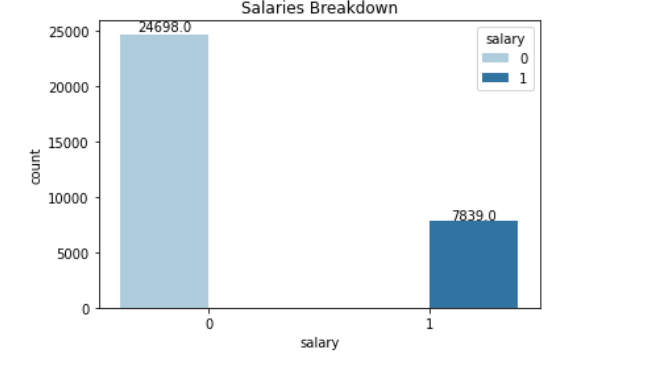
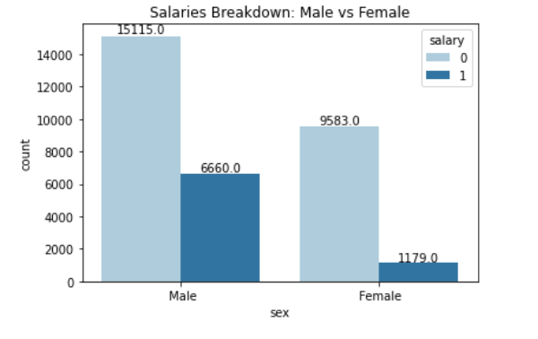
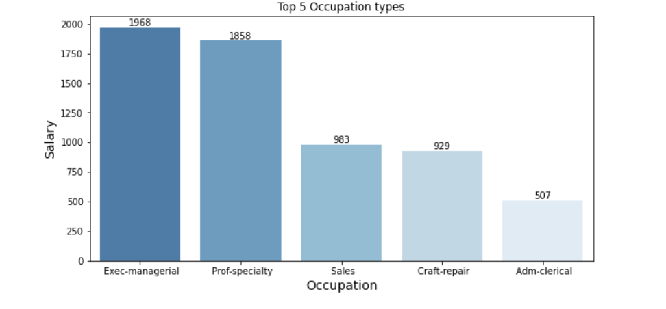

# Salary-Prediction-Analysis

**Source of data**: [Kaggle](https://www.kaggle.com/datasets/ayessa/salary-prediction-classification)

**Description**: Extraction of data done by Barry Becker from the 1994 Census database. The prediction task is to determine whether a person makes less or equal to $50k or more a year. The dataset includes numerical and categorical data. 

*   **Target**: Salary
*   This is a **Classification** problem

*   **Features**: 14 total

*   **Rows**: 32,537

*   **Challenges**: Since the data derives from old census data, there may be data that is missing. Real world data seems to have challenges with possible inconsistent values due to user error or incorrect dates.

## Methods
#### Handling Missing/Duplicate Values
This dataset contained no missing values while there were 24 duplicates values. Duplicate values were dropped as they represent an insignificant amount of data within our dataset. 
 
 

## Exploratory Analysis 

#### Salary Breakdown

> Here we see the Salary breakdown; most of our data is within the less than or equal to $50k with 76%. (0 equals <=$50k and 1 equals >$50k)
 

#### Salary between the Genders

> Salary breakdown between genders; we see that the Male gender contains a larger amount of data falling into the more than $50k category.
 

##### Top 5 Occupations: More than $50k

> Top 5 occupations within the more than $50k category.
 

## PowerBI Dashboard
<a href="Salary_Prediction_Analysis_all.pdf" target="_blank">PowerBI Dashboard: All Individuals</a>
 

<a href="Salary_Prediction_Analysis_less_50k.pdf" target="_blank">PowerBI Dashboard: Individuals making less or equal to $50k</a>
 

<a href="Salary_Prediction_Analysis_more_50k.pdf" target="_blank">PowerBI Dashboard: Individuals making more than $50k</a>
 

>For full access to interactive Salary Prediction Analysis Dashboard <a href="https://app.powerbi.com/groups/me/reports/8fefbc9b-babc-4957-b8d0-61e670e5f983?ctid=4981a704-f6a3-4ac0-89c2-a3812354a3ff&pbi_source=linkShare" target="_blank">Click here</a>
 

# Results
 

**Salary Prediction Analysis Presentation**:<a href="https://docs.google.com/presentation/d/1DWoRXdvNVrWKYUw72BFdQDpyIZZYY6j70uRr9utBPJg/edit?usp=sharing"> Click here</a>

